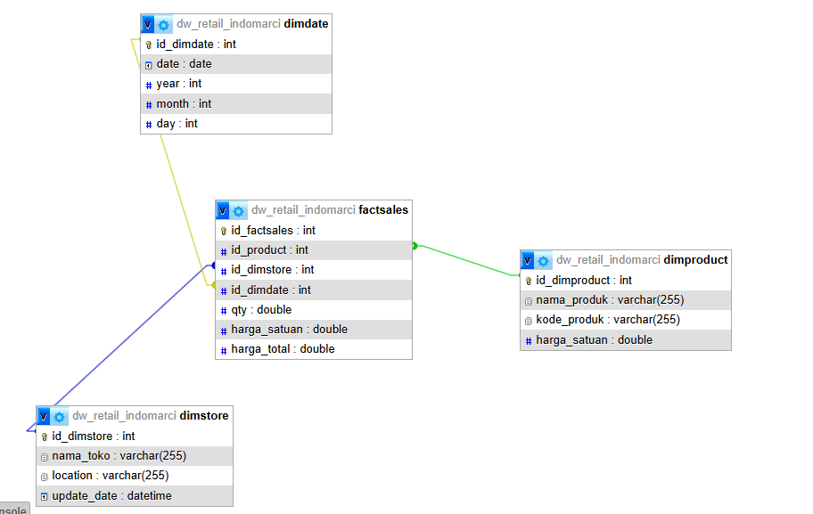

# 🛒 Retail Analytics Dashboard: PT. Indomarci Prismatami (Dummy Project Matkul BI)

Visualisasi: https://datastudio.google.com/reporting/ff48f23d-882a-4158-b0fc-30a07367be0f

## 📖 Latar Belakang Studi Kasus
**PT. Indomarci Prismatami** adalah perusahaan retail dengan cabang utama di Jakarta. Perusahaan ini memiliki 2 (dua) toko retail unggulan yang berlokasi di Kota Malang, yaitu:
1. **Betamart**: Toko milik internal Indomarci yang berlokasi di Jl. Kawi.
2. **Matahariku**: Toko hasil inisiasi kerjasama dengan salah satu Perguruan Tinggi.

Meskipun memiliki *branding* yang berbeda, manajemen kedua toko tersebut tetap berada di bawah naungan PT. Indomarci. Untuk mengoptimalkan strategi bisnis, manajemen membutuhkan sebuah sistem analitik (Data Warehouse & Dashboard) yang mengintegrasikan data dari kedua toko (yang awalnya berada di database OLTP terpisah) guna mendapatkan wawasan bisnis yang komprehensif.

## 🎯 Tujuan Analisis (Business Questions)
Proyek Data Warehouse dan Dashboard ini dibangun untuk menjawab pertanyaan bisnis utama dari manajemen:
1. **Produk apa yang paling laku** di masing-masing toko (Betamart vs. Matahariku)?
2. **Toko mana yang memiliki omset (revenue) terbesar** di tiap bulannya?

## 🏗️ Arsitektur Data & Proses ETL
Sistem ini menggunakan arsitektur **Data Warehouse** dengan desain **Star Schema**. Alur pengolahan datanya adalah sebagai berikut:

1. **Ekstraksi Data (OLTP)**: Data transaksi ditarik dari dua sumber database operasional (OLTP) yang berbeda, yaitu sistem kasir Betamart dan Matahariku.
2. **Transformasi & Load (ETL dengan Pentaho)**: Menggunakan **Pentaho Data Integration (PDI)** untuk melakukan pembersihan, penggabungan, dan transformasi data. Terdapat *pipeline* ETL (Transformations/Jobs) khusus untuk memuat data ke masing-masing tabel dimensi dan fakta:
   - Pipeline `dimdate`
   - Pipeline `dimproduct`
   - Pipeline `dimstore`
   - Pipeline `factsales`
3. **Data Warehouse (OLAP)**: Data yang telah diolah disimpan ke dalam database OLAP (`dw_retail_indomarci`) menggunakan pendekatan Star Schema.
4. **Visualisasi Data (Dashboard)**: Data dari Data Warehouse divisualisasikan menggunakan platform Business Intelligence untuk menjawab *business questions*.

## 🗄️ Desain Skema Database (Star Schema)
Data Warehouse `dw_retail_indomarci` dirancang dengan 1 Fact Table dan 3 Dimension Tables:

### Fact Table
* **`factsales`**: Menyimpan metrik transaksi utama.
  * `id_factsales` (PK)
  * `id_product` (FK ke dimproduct)
  * `id_dimstore` (FK ke dimstore)
  * `id_dimdate` (FK ke dimdate)
  * `qty` (Jumlah barang terjual)
  * `harga_satuan` (Harga per item saat transaksi)
  * `harga_total` (Total penjualan / `qty * harga_satuan`)

### Dimension Tables
* **`dimdate`**: Menyimpan hierarki waktu untuk analisis tren bulanan/tahunan.
  * `id_dimdate` (PK)
  * `date`, `year`, `month`, `day`
* **`dimstore`**: Menyimpan informasi lokasi dan identitas toko.
  * `id_dimstore` (PK)
  * `nama_toko` (Betamart / Matahariku)
  * `location` (Contoh: Jl. Kawi)
  * `update_date`
* **`dimproduct`**: Menyimpan profil barang yang dijual.
  * `id_dimproduct` (PK)
  * `nama_produk`, `kode_produk`, `harga_satuan`

## 🛠️ Teknologi yang Digunakan
* **Database / OLAP Engine**: MySQL 
* **ETL Tool**: Pentaho Data Integration 
* **Data Visualization**: Looker Studio
* **Konsep DWH**: Star Schema, ETL Pipeline, OLTP to OLAP Transformation.

---
